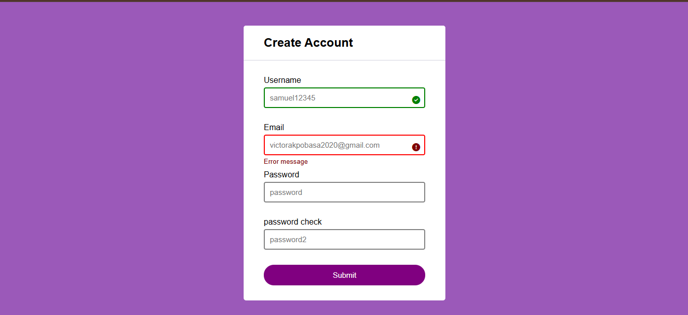

# ✅ FORM VALIDATION PROJECT

## 🌟 About the Project  

 Form Validation Project

The Form Validation Project ensures user inputs meet specific requirements before submission, enhancing data accuracy and user experience. It provides real-time feedback, preventing invalid data entries and improving form usability.

✨ Features
Validation for required fields (name, email, password, etc.)
Real-time error messages for incorrect inputs
Email format validation
Password strength check (minimum length, special characters, etc.)
Confirm password match verification
Custom error messages for better user guidance

🚀 Technologies Used
HTML
CSS
JavaScript

🔧 How It Works
Users fill out the form fields.
The system checks inputs and provides instant feedback.
Errors are highlighted if inputs are invalid.

The form submits only when all fields pass validation.

## 🚀 Live Demo  
🔗 [Visit the Website](https://vowel-checker-app-phi.vercel.app/)

